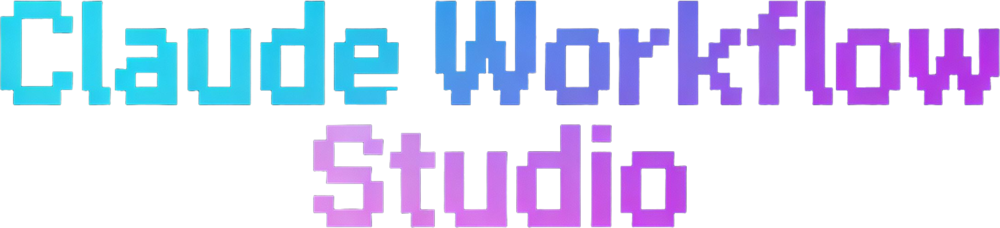
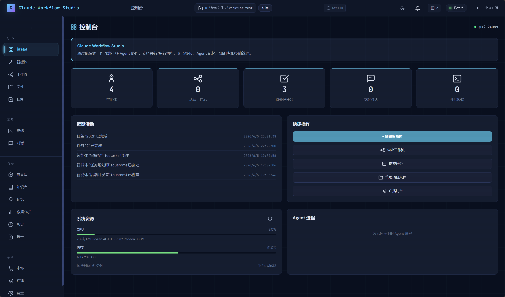
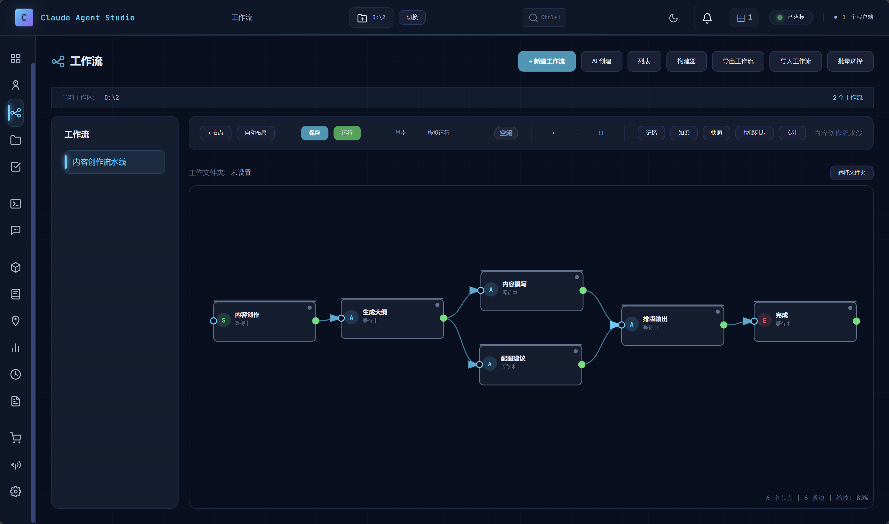
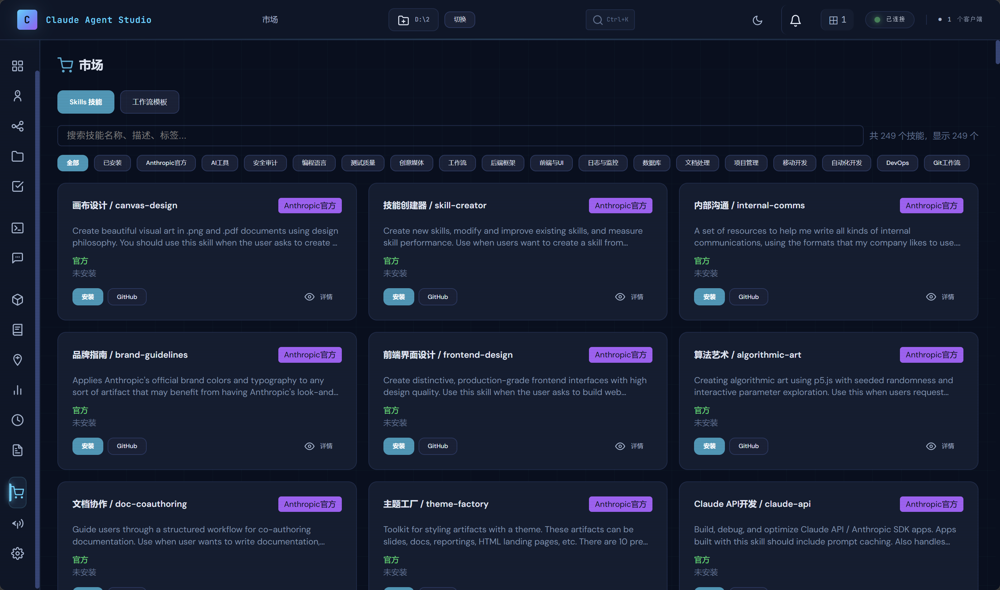
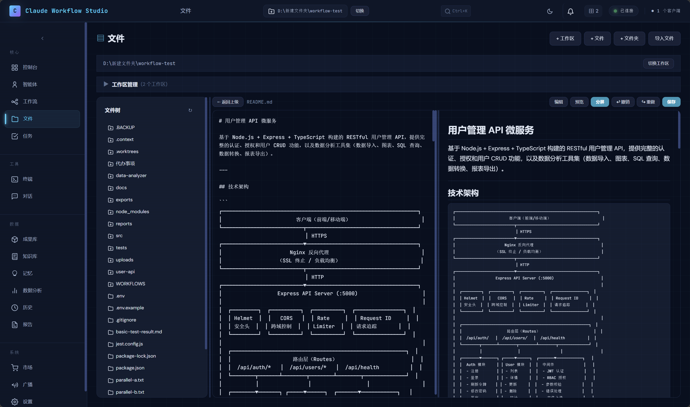

<p align="center">
  
</p>

<p align="center">
  <a href="README.md">中文</a> · <a href="README_EN.md">English</a>
</p>

<p align="center">
  
  
  
  
</p>

<p align="center">一个基于 Web 的可视化平台，用于编排、监控和管理多个 Claude Code Agent 协作完成复杂任务。</p>

> ⚠️ **开发状态：实验性预览版** — 本项目由知识面较浅薄的大一学生自行开发，功能可能有很多不完善之处，存在未发现的 Bug。**未经充分生产环境测试，请不要用于重要文件的修改上。** 欢迎 Fork 自行修改。维护时间有限，Issue 和 PR 处理可能不及时。

<p align="center">
  
  
</p>
<p align="center">
  
  
</p>

---

## 快速开始

**环境要求**：[Node.js 18+](https://nodejs.org/) 和 [Claude Code CLI](https://docs.anthropic.com/en/docs/claude-code)

**安装**：解压 ZIP → 双击 `install.bat` → 双击 `start.bat` → 访问 http://localhost:3000

```bash
npm install    # 或双击 install.bat
npm start      # 或双击 start.bat
```

---

## 快速上手

**单 Agent 任务**：智能体 → 创建智能体 → 任务 → 创建任务 → 选择 Agent → 输入需求 → 执行

**多 Agent 流水线**：
1. 工作流 → 创建工作流 → 拖入 Agent 节点 → 连线 → 保存
2. 任务 → 创建任务 → 选择关联工作流 → 输入任务描述 → 执行

**文件管理**：文件 → 浏览/新建/编辑工作区内的文件

---

## 核心功能

| 功能 | 说明 |
|------|------|
| **双轨闭环架构** | 主Agent（原生API）协调 + 子Agent（SDK）执行，物理隔离防幻觉 |
| **可视化工作流** | 6 种节点类型（Agent/评估/审批/条件分支/子工作流），拖拽编排，AI 自然语言生成 |
| **工作流模板** | 17 个内置模板，覆盖代码审查、Bug 修复、文档生成、安全审计等场景 |
| **技能市场** | 丰富的技能库，安装后自动创建 SKILL.md 文件，SDK 自动发现 |
| **自治判断节点** | AI 审查代码/内容，返回 JSON 格式 pass/fail，支持自愈循环 |
| **人工审批节点** | 编排器级别拦截，暂停等待人工审核，支持通过/拒绝，拒绝后自动将反馈传回主 Agent 重试修改 |
| **实时流式输出** | 所有子 Agent 输出通过 WebSocket 实时推送（50ms 合流缓冲） |
| **断点续传** | 节点级检查点，崩溃或暂停后从断点恢复 |
| **记忆系统** | 按工作区隔离存储，支持开关控制、跨工作流传递、共享数据池 |
| **内嵌终端** | 基于 node-pty 的真实 PTY 终端，支持所有 shell 命令，自动在当前工作区打开 |
| **多工作区** | 独立运行环境，数据隔离，支持批量克隆工作流到其他工作区 |
| **实时 CRUD 推送** | Agent/Workflow/Task 的创建、更新、删除通过 WebSocket 实时通知前端 |
| **任务队列** | 批量执行，支持暂停/恢复/取消，优先级+时间排序 |
| **知识库** | 分类/标签管理，全文搜索，可注入 Agent 执行，本地持久化存储 |
| **数据分析** | 执行统计、成功率、平均耗时、按工作流统计、执行时间线 |
| **崩溃恢复** | 服务器重启自动修复卡在 running 的执行记录 |
| **AI 对话** | 只读模式，支持 WebSearch、WebFetch、文件读取/搜索 |
| **安全** | API Key AES-256-GCM 加密、命令白名单、并发执行防护、工作区沙箱、文件访问限制 |
| **API密钥检测** | 启动时自动检测API密钥配置，未配置时弹出提示引导用户设置 |

### 工作流节点

| 节点 | 说明 |
|------|------|
| **开始** | 工作流入口 |
| **Agent** | 调用 AI 执行任务 |
| **自治判断** | AI 审查代码/内容，返回 JSON {pass, reason}，支持自愈循环 |
| **人工审批** | 暂停等待用户审批，支持通过/拒绝 |
| **条件分支** | 根据上游输出判断，选择一条分支执行 |
| **子工作流** | 引用其他工作流，内联执行 |
| **结束** | 汇总最终结果 |

---

## 技术栈

| 层 | 技术 |
|---|---|
| 前端 | HTML + CSS + TypeScript/JS（SPA）+ xterm.js |
| 后端 | Node.js + Express + TypeScript |
| 实时通信 | WebSocket (ws)，实时 CRUD 事件推送 |
| AI 执行引擎 | 双轨闭环：主Agent（原生 Anthropic API）+ 子Agent（Claude Agent SDK） |
| 数据持久化 | sql.js (WASM SQLite) + JSON 文件 |

---

## 常见问题

**Q: Agent 执行失败？** → 检查 CLI 是否安装（`claude --version`），CLI 不可用时自动回退 SDK 模式

**Q: 工作流中断了？** → 重启服务，点击「续传」从断点恢复

**Q: 数据会丢吗？** → 每 2 秒自动保存，正常关闭不会丢数据

**Q: 能管理多个项目吗？** → 可以，通过「文件」→「切换工作区」创建独立环境

---

## 常用命令

```bash
npm start              # 启动服务器
npm run dev            # 开发模式（自动重启）
npm test               # 运行测试
```

### 批处理脚本（Windows）

| 脚本 | 说明 |
|------|------|
| `install.bat` | 一键安装依赖 |
| `start.bat` | 启动服务 |
| `stop.bat` | 停止服务 |
| `restart.bat` | 重启服务 |
| `logs.bat` | 查看日志 |
| `add-to-startup.bat` | 添加开机自启 |
| `remove-from-startup.bat` | 取消开机自启 |

---

> 深度技术文档（执行引擎、记忆系统、安全机制、API 概览等）请参考 [docs/architecture.md](docs/architecture.md)。
> English version: [docs/architecture_EN.md](docs/architecture_EN.md)

---

## 许可证

[MIT License](LICENSE)
